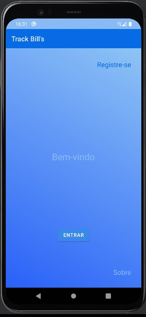

<h1 align="center">
 
TrackBill's App 
 
 

Projeto da criação de uma app de gestão financeira como parte do projeto de mentoria no desenvolvimento de aplicações Android no CESAR

 
<h3><b>Demo</b></h3>
  

## Getting started

####  Setup:  

* **Android Studio (bumblebee)**

* **Android API 28 (Android 9)**

* **Gradle 7.2**

